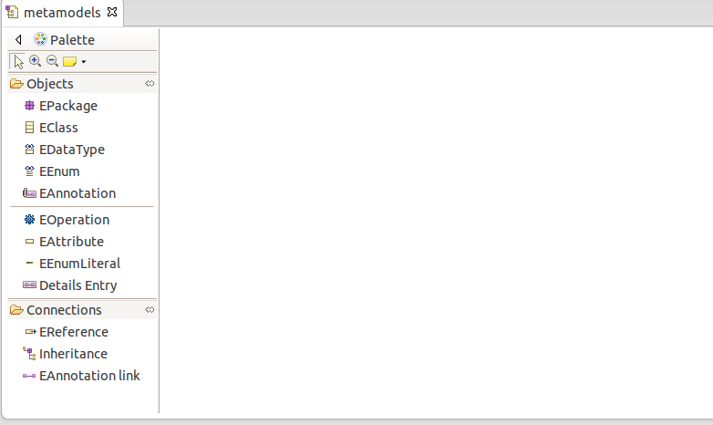
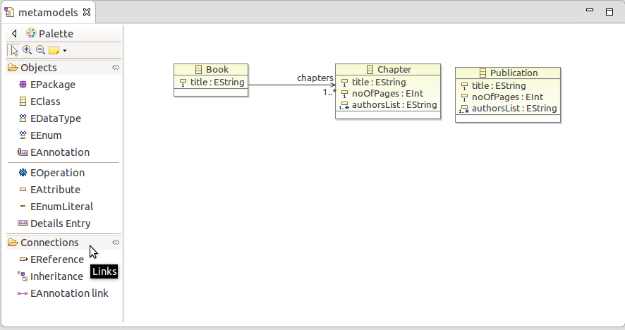
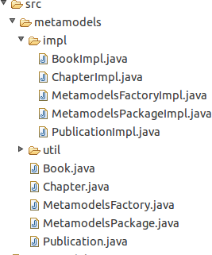

## The Five Minutes SiTra tutorial with EMF {#emffiveminutes}

In the [Five Minutes Tutorial](./fiveminutes.html), the metamodels of the
source and destination were created manually as Plain Old Java Objects (POJOs).
Advocates of high-level modelling may produce the metamodels in UML class
diagrams  for documentation and better communication.  In such cases, we can
create POJOs and factories to generate objects used in SiTra transformations
*automatically*. 

[Eclipse Modeling Framework][1] (EMF) is a well supported  modelling framework
for code generation.  EMF has a wide range of capabilities. For example, we can
use EMF to convert models between Java code, UML models, Ecore and XSD
documents.  See the official [EMF website][1] for links to tutorials and  books
about EMF.  The *aim* of this tutorial is to explain how to 

1. Create Ecore models to produce a representation of the metamodels in class
diagram format,
2. automatically generate java code from the diagrams, and finally
3. write a transformation to repeat the task carried out in  [Five Minutes
Tutorial](./fiveminutes.html).

**Download** Eclipse Modelling Tool from the [Eclipse website][eclipse].
Alternatively, you can install Eclipse Modelling Tool packages in your current
installation of Eclipse. There are a number of good tutorials on EMF, among
them:

* [Eclipse Modeling Framework (EMF) - Tutorial by Lars Vogel](http://www.vogella.com/tutorials/EclipseEMF/article.html) and
* [What every Eclipse developer should know about EMF by Maximilian Koegel](http://eclipsesource.com/blogs/tutorials/emf-tutorial/) 

The following is a short description of the steps involved in the  creation of
the Ecore model for the  [Five Minutes Tutorial](./fiveminutes.html), use the
above tutorials as cheatsheets to fill in the gaps. 

### Producing Ecore model of metamodels
* After downloading 
and installing Eclipse Modelling Tool, create a project by going to   *File*
&rarr; *new* &rarr; *Ecore Tools Project*. Call your project *FiveMinutes*.  

* Right-click on FiveMinutes in Project Explorer pane and then *file* &rarr; 
 *new* &rarr;  *ecore diagram*. Call the  ecore model *metamodels*.  You should
see the following Palette which has drag and drop components for producing
classes (EClass), attributes (EAttribute), &hellip;

* Click on EClass on Palette and then click on the drawing pane to 
produce three classes.  Name them *Book*, *Chapter* and *Publication*.  You can
modify the name of the classes from *Properties* pane. 

* Right click on EAttribute in the *Pallete* and then click on the attribute
fields of the class *Book*. Go to *Properties*. Change *Name* to *title*,
*Lower Bound* to 1 and *EType* to *EString \[java.lang.String\]*.  Setting the
lower bound and upper bound to 1 enforces the model to have exactly one *title*
attribute. Also add *title* attribute to both *Chapter* and *Publication*. Also
add *noOfPages* attribute of type *EInt \[int\]* with Lower  Bound to *Chapter*
and *Publication*.

* add the attribute *authorsList* of type EString to Chapter. 
Set the Lower Bound to 1 and the Upper Bound to *.  This will make sure that
the *authorsList* is a collection of String. In the *Properties* pane click on
the *Advanced* will bring all setting of the *authorsList*.  Make sure the
parameter *Unique* is set to *true*.  This will ensure that the name of authors
are unique.  The parameter *Upper Bound* is set to -1, which is the same as
upper multiplicity \*. As a result, *authorsList*  will be a set of Strings.
Similarly add the attribute *authorsList* to *Publication*.

* Click on *EReference* to produce an *association* from 
*Book* to *Chapter*. In *Properties* pane name the *EReference* to *chapters*,
modify Lower Bound to 1 and  Upper Bound to -1 to ensure that the association
has the multiplicity of 1...\* at the side that it connects to *Chapter*. At
the end, your drawing pane should look like the following.

### Automated code generation from the Ecore models
We shall start by creating an EMF Generator model.

* locate the file *metamodel.ecore* in the *Project Explorer* pane, right
click *New* &rarr; *other* &rarr; *EMF Generator Model*. The file name is
*metamodels.genmodel*.  Click *Next* and you will be prompted to *Select a
Model Importer*.  Select *Ecore model*, *load* and click through to *Next* and
*Finish*.  In your *Project Explorer* pane you will end up with a new tree
*meamodel.genmodel*. Click on it a new pane opens.  In the newly opened pane
right click on *Metamodels* and choose *Generate Model Code*. A directory *src*
with two subfolder containing interfaces and their implementations will be
created as follows.   

Spend some time and explore the auto-generated code and the created POJOs.
Produce a separate package, such as *uk.ac.bham.cs*, for your transformation
files.  The following code uses the produced factories for making source
objects.
<pre data-src="./fiveminutesfiles/emf/TestRules.java">Generating Objects via factories </pre>
Run the above program to print the chapters and their attributes.

### Running the  transformations 
The produced objects can now be used within a SiTra transformation.  For a
description of the transformation see [Five Minutes
Tutorial](./fiveminutes.html).  Following the tutorial download the latest
version of the SiTra and import it to  your IDE.  *BookToPublication*
Transformation is slightly different from the version in the  [Five Minutes
Tutorial](./fiveminutes.html), Firstly, created factories must be used to
produce the destination objects.  Secondly, the auto-generated code provides a
set of *get* Methods that return instances of the variables representing the
attributes. This is a bit different from using  a *set* method in the [Five
Minutes Tutorial](./fiveminutes.html). For further information about the
auto-generated code  and the reason behind the style of implementation see the
EMF website or the above tutorials. 

<pre data-src="./fiveminutesfiles/emf/BookToPublication.java">
New version of BookToPulication</pre>

### Executing the transformation
Similar to [Five Minutes Tutorial](./fiveminutes.html) we can run the
transformation.
<pre data-src="./fiveminutesfiles/TestRules.java">Executing transformation</pre>
Running the above will produce 
<pre data-src="./fiveminutesfiles/resulte.log">produced publication</pre>

[1]: http://www.eclipse.org/modeling/emf/ "EMF website on Eclipse.org"
[eclipse]: http://www.eclipse.org "Eclipse site"
[emt]: http://eclipse.org/downloads/packages/eclipse-modeling-tools/keplersr2
